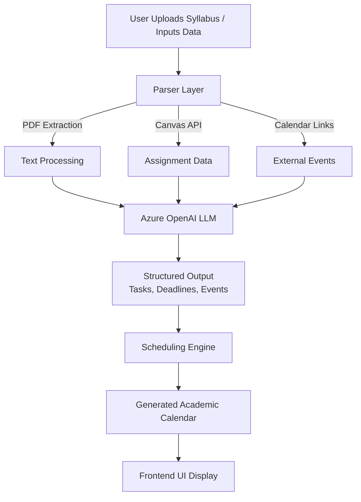

# AI Academic Calendar Platform

## Overview

This project is an AI-powered academic scheduling system that automates the process of planning coursework and managing deadlines.

Students often struggle to manually track assignments across multiple syllabi, platforms, and formats. This system solves that by parsing course materials (PDFs, Canvas data, and calendar links) and automatically generating a structured, personalized academic calendar.

---

## Features

* Automatic syllabus parsing from PDFs and course documents
* Integration with Canvas for assignment and deadline tracking
* Calendar link ingestion for real-time schedule updates
* AI-powered extraction of tasks, deadlines, and events
* Personalized calendar generation with minimal manual input
* Dynamic updating of schedules as new data is introduced

---

## Tech Stack

* **Frontend:** JavaScript (UI-based interface)
* **Backend:** Node.js (event processing and scheduling logic)
* **AI / LLM:** Azure OpenAI
* **Integrations:** Canvas API, PDF parsing, calendar link ingestion

---

## System Architecture

---

## How It Works

1. Users upload course syllabi, connect Canvas, or provide calendar links
2. The system extracts raw data from PDFs and external sources
3. Azure OpenAI processes unstructured text and identifies key academic events
4. Extracted data is converted into structured tasks and deadlines
5. A scheduling engine organizes events into a unified calendar
6. The frontend displays a personalized, dynamically updated academic schedule

---

## Key Highlights

* Eliminates manual planning across multiple courses
* Uses LLMs to interpret unstructured academic documents
* Combines multiple data sources into a single unified system
* Designed for scalability across different academic environments

---

## Future Improvements

* Add real-time syncing with Google Calendar / Outlook
* Implement deadline prioritization and smart reminders
* Support multi-user collaboration for group projects
* Enhance UI/UX for mobile-first experience

---

## Screenshots

*Add screenshots of your UI here if available*
